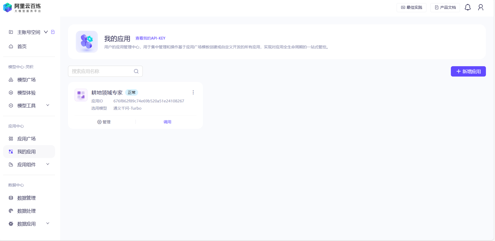

# dongye-fastChat-stater

一个轻量级的Java SDK，用于对接国内通义千问大模型API。一个方法帮你实现会话管理、历史消息管理、不同大模型切换以及SSE或Websocket输出的功能。

### 引入：

一：

1克隆本项目

2将项目中dongye-fastChat-stater引入您的项目

```
       <dependency>
            <groupId>com.dongye.lxs</groupId>
            <artifactId>dongye-fastchat-starter</artifactId>
            <version>0.0.1-SNAPSHOT</version>
        </dependency>
```

二：

1克隆本项目

2自行打包或者使用海南大学大数据与知识图谱协会总群中我提供的jar包

3进入maven的bin目录

4cmd并输入一下目录

```
mvn -e install:install-file -Dfile=C:\Users\26010\Downloads\dongye-fastchat-starter-0.0.1-SNAPSHOT.jar -DgroupId=com.dongye.lxs  -DartifactId=dongye-fastchat-starter   -Dversion=0.0.1-SNAPSHOT  -Dpackaging=jar
```

5直接引入依赖

```
       <dependency>
            <groupId>com.dongye.lxs</groupId>
            <artifactId>dongye-fastchat-starter</artifactId>
            <version>0.0.1-SNAPSHOT</version>
        </dependency>
```

### 使用方法：

目前该sdk仅仅实现对接阿里通义千问模型

1：开通服务

[阿里云百炼 (aliyun.com)](https://bailian.console.aliyun.com/?spm=5176.28515448.J_TC9GqcHi2edq9zUs9ZsDQ.1.543d38b1i3y6N9#/home)



选择新建应用获取appId

点击查看api-key创建api-key

2：引入配置

-  application.yml引入

  ```
  dongye:
    fastchat:
      dashscope:
        appId: 676f862f89c74e69b520a51e24108267
        apiKey: sk-87c476dd5822400990fc97a3d706d55a
  ```

- 在你项目的启动类上填加

  ```
  @Import(com.dongye.lxs.chat.config.fastChatConfig.class)
  ```

3：参考我项目上的demo代码

```java
/**
     * 普通询问，非流式传输
     * @param fastChatRequestDto
     * @return
     */
    public ClientResponse<ClientOutput> normalAsk(fastChatRequestDto fastChatRequestDto) {

        //modelSourceSSE流式传输或普通传输
        //requestId请求id，用于区分每次请求 实现幂等
        ClientInput clientInput = ClientInput.builder()
                .modelSource(ModelSource.DASHSCOPE_Normal)
                .requestId(UUID.randomUUID().toString().replace("-", ""))
                .build();
        BeanUtils.copyProperties(fastChatRequestDto, clientInput);

        ClientOutput data = null;
        try {
            ClientResponse<Object> call = DyChatClient.call(clientInput);
            data = (ClientOutput) call.getData();
            ChatContext context = data.getContext();
            if (context != null) {
                log.info("context:{}", context);
            }
            //summary问答总结
            String summary = context.getSummary();
            //历史记录，这里应该将记录更新到对应的聊天记录表中
            List<Message> messageList = context.getMessageList();
            //会话id 第一次提问不需要传，之后的多轮对话传入sessionId 本SDK自动帮你返回聊天记录历史消息，一个小时内有效
            String sessionId = data.getSessionId();
            //本次问题的回答，实现自动转为html格式
            String answer = data.getAnswer();
        } catch (NoApiKeyException | InputRequiredException e) {
            //这里可以记录日志
            log.error("请求大模型接口失败", e);
            return ClientResponse.errorRequest("请求大模型接口失败");
        }
        return ClientResponse.success(data);
    }

    /**
     * 流式传输
     * @param fastChatRequestDto
     * @return
     */
    public ClientResponse<ClientOutput> sseAsk(fastChatRequestDto fastChatRequestDto) {
        //modelSourceSSE流式传输或普通传输
        //requestId请求id，用于区分每次请求 实现幂等
        ClientInput clientInput = ClientInput.builder()
                .modelSource(ModelSource.DASHSCOPE_SSE)
                .requestId(UUID.randomUUID().toString().replace("-", ""))
                .build();
        BeanUtils.copyProperties(fastChatRequestDto, clientInput);
        SseEmitter sseEmitter = new SseEmitter();
        ClientOutput data = null;
        try {
            ClientResponse<Object> call = DyChatClient.call(clientInput);
             data = (ClientOutput) call.getData();
            sseEmitter = data.getSseEmitter();
        } catch (NoApiKeyException | InputRequiredException e) {
            log.error("请求大模型接口失败", e);
            sseEmitter.completeWithError(e);
        }
        return ClientResponse.success(data);
    }

```

4：效果

```
http://127.0.0.1:8080/fastChat/normalAsk
```

```
{
"userId":"1",
"userName":"lxs",
"question": "介绍一下海南大学",

}
```

返回值：

```
{
    "code": 200,
    "message": "成功",
    "data": {
        "context": {
            "summary": "综合性大学海南大学",
            "messageList": [
                {
                    "messageMap": {
                        "USER": "介绍一下海南大学",
                        "MODEL": "<p>海南大学，创建于1958年，位于中国海南省，是海南省的重点综合性大学之一，提供本科、硕士和博士多层次教育。该校学科涵盖工、管、经、法、文、理、医、教、艺等多个领域，以培养具有国际视野、创新能力和实践技能的高级专门人才为目标。</p>\n"
                    }
                }   
            ],
            "time": "2024-08-03T16:16:44.0299741"
        },
        "answer": "<p>海南大学，创建于1958年，位于中国海南省，是海南省的重点综合性大学之一，提供本科、硕士和博士多层次教育。该校学科涵盖工、管、经、法、文、理、医、教、艺等多个领域，以培养具有国际视野、创新能力和实践技能的高级专门人才为目标。</p>\n,
        "sessionId": "1db0c7d8e2d248ae9b062ca0c8826612",
        "sseEmitter": null
    }
}
```

携带sessionId（上一个的返回值）

```
{
"userId":"1",
"userName":"lxs",
"question": "介绍一下海南大学的学院",
"sessionId":"1db0c7d8e2d248ae9b062ca0c8826612"
}
```

返回效果如下：自动返回该会话的历史消息，自动实现消息体的html格式

```
{
    "code": 200,
    "message": "成功",
    "data": {
        "context": {
            "summary": "",
            "messageList": [       
                {
                    "messageMap": {
                        "USER": "介绍一下海南大学",
                        "MODEL": "<p>海南大学，创建于1958年，位于中国海南省，是海南省的重点综合性大学之一，提供本科、硕士和博士多层次教育。该校学科涵盖工、管、经、法、文、理、医、教、艺等多个领域，以培养具有国际视野、创新能力和实践技能的高级专门人才为目标。</p>\n"
                    }
                },
                {
                    "messageMap": {
                        "USER": "介绍一下海南大学的学院",
                        "MODEL": "<p>海南大学设有多个学院，涵盖了广泛的学科领域，包括但不限于：</p>\n<ol>\n<li>\n<p><strong>管理学院</strong>：专注于管理科学与工程、工商管理、会计学、财务管理等领域的教学与研究。</p>\n</li>\n<li>\n<p><strong>经济学院</strong>：提供经济学、金融学、国际贸易等课程，培养学生在经济与金融领域的专业能力。</p>\n</li>\n<li>\n<p><strong>法学院</strong>：教授法律专业知识，包括法学理论、法律实务、国际法等，培养法律人才。</p>\n</li>\n<li>\n<p><strong>文学院</strong>：涵盖汉语言文学、新闻传播学、历史学、哲学等文科基础学科。</p>\n</li>\n<li>\n<p><strong>理学院</strong>：包括数学、物理学、化学、生物科学等自然科学基础学科。</p>\n</li>\n<li>\n<p><strong>信息科技学院</strong>：涉及计算机科学与技术、软件工程、网络空间安全、人工智能等领域，培养信息技术专业人才。</p>\n</li>\n<li>\n<p><strong>海洋学院</strong>：专注于海洋科学与技术、海洋资源与环境等领域的研究与教学，服务海洋经济发展。</p>\n</li>\n<li>\n<p><strong>医学院</strong>：提供医学及相关专业教育，包括临床医学、公共卫生、护理学等，培养医疗卫生领域专业人员。</p>\n</li>\n<li>\n<p><strong>外国语学院</strong>：教授英语、日语、法语、俄语等外语及翻译、跨文化交际等相关课程。</p>\n</li>\n<li>\n<p><strong>马克思主义学院</strong>：研究马克思主义理论及其应用，培养社会主义意识形态建设者。</p>\n</li>\n</ol>\n<p>海南大学的学院设置反映了其致力于全面发展的教育理念，为学生提供了广泛的专业选择和深入研究的机会。</p>\n"
                    }
                }
            ],
            "time": "2024-08-03T16:16:44.0299741"
        },
        "answer": "<p>海南大学设有多个学院，涵盖了广泛的学科领域，包括但不限于：</p>\n<ol>\n<li>\n<p><strong>管理学院</strong>：专注于管理科学与工程、工商管理、会计学、财务管理等领域的教学与研究。</p>\n</li>\n<li>\n<p><strong>经济学院</strong>：提供经济学、金融学、国际贸易等课程，培养学生在经济与金融领域的专业能力。</p>\n</li>\n<li>\n<p><strong>法学院</strong>：教授法律专业知识，包括法学理论、法律实务、国际法等，培养法律人才。</p>\n</li>\n<li>\n<p><strong>文学院</strong>：涵盖汉语言文学、新闻传播学、历史学、哲学等文科基础学科。</p>\n</li>\n<li>\n<p><strong>理学院</strong>：包括数学、物理学、化学、生物科学等自然科学基础学科。</p>\n</li>\n<li>\n<p><strong>信息科技学院</strong>：涉及计算机科学与技术、软件工程、网络空间安全、人工智能等领域，培养信息技术专业人才。</p>\n</li>\n<li>\n<p><strong>海洋学院</strong>：专注于海洋科学与技术、海洋资源与环境等领域的研究与教学，服务海洋经济发展。</p>\n</li>\n<li>\n<p><strong>医学院</strong>：提供医学及相关专业教育，包括临床医学、公共卫生、护理学等，培养医疗卫生领域专业人员。</p>\n</li>\n<li>\n<p><strong>外国语学院</strong>：教授英语、日语、法语、俄语等外语及翻译、跨文化交际等相关课程。</p>\n</li>\n<li>\n<p><strong>马克思主义学院</strong>：研究马克思主义理论及其应用，培养社会主义意识形态建设者。</p>\n</li>\n</ol>\n<p>海南大学的学院设置反映了其致力于全面发展的教育理念，为学生提供了广泛的专业选择和深入研究的机会。</p>\n",
        "sessionId": "1db0c7d8e2d248ae9b062ca0c8826612",
        "sseEmitter": null
    }
}
```

### 最后：

因本人目前实习以及秋招事情过多，当然还有懒惰的原因，计划实现的websocket模块和对接其他厂模型的计划暂时搁置，欢迎其他小伙伴给本项目提交pr。